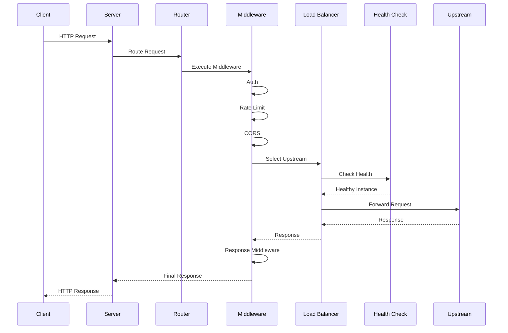
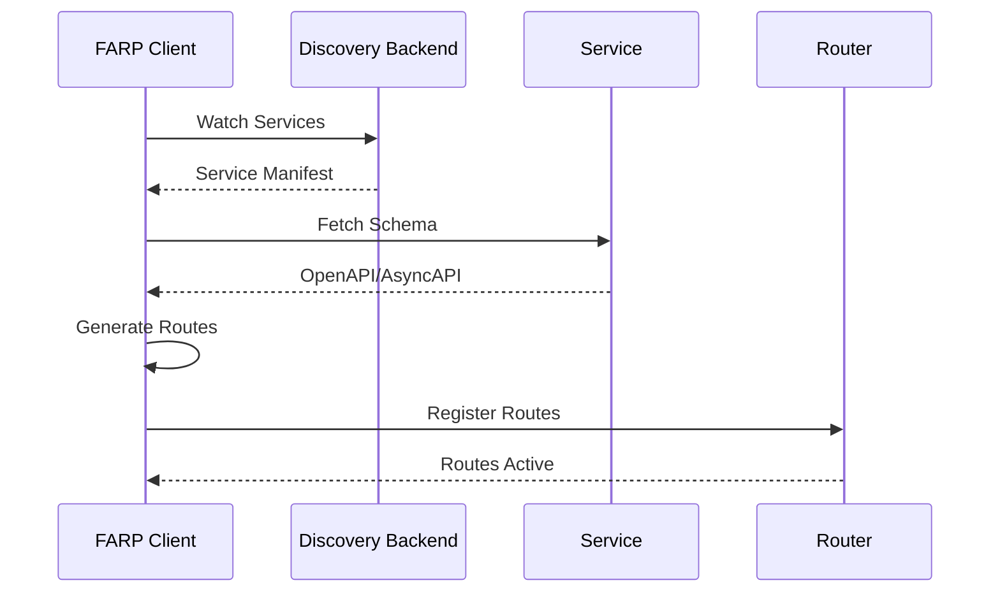

import { Callout } from 'fumadocs-ui/components/callout';

# Architecture

Octopus is designed as a high-performance, modular, and extensible API gateway built in Rust.

## System Overview

```
┌────────────────────────────────────────────────────────────────────┐
│                         Client Layer                                │
│  HTTP/HTTPS │ gRPC │ WebSocket │ SSE │ GraphQL │ WebTransport     │
└────────────────────────────────┬───────────────────────────────────┘
                                 │
┌────────────────────────────────▼───────────────────────────────────┐
│                      Octopus API Gateway                            │
├────────────────────────────────────────────────────────────────────┤
│                                                                      │
│  ┌──────────────────────────────────────────────────────────────┐ │
│  │                    Protocol Layer                             │ │
│  │  ┌──────────┐ ┌──────────┐ ┌──────────┐ ┌──────────────┐   │ │
│  │  │   HTTP   │ │   gRPC   │ │    WS    │ │   GraphQL    │   │ │
│  │  │  Handler │ │  Handler │ │  Handler │ │  Federation  │   │ │
│  │  └─────┬────┘ └─────┬────┘ └─────┬────┘ └──────┬───────┘   │ │
│  └────────┼────────────┼────────────┼──────────────┼───────────┘ │
│           │            │            │              │               │
│  ┌────────▼────────────▼────────────▼──────────────▼───────────┐ │
│  │                 Middleware Pipeline                           │ │
│  │  Auth │ RateLimit │ CORS │ Compression │ Scripting │ Metrics │ │
│  └───────────────────────────┬───────────────────────────────────┘ │
│                              │                                       │
│  ┌───────────────────────────▼───────────────────────────────────┐ │
│  │                     Router & Matcher                           │ │
│  │  - Trie-based path matching                                    │ │
│  │  - Dynamic route registration from FARP                        │ │
│  │  - Load balancing (Round-robin, Least-conn, Weighted)         │ │
│  └───────────────────────────┬───────────────────────────────────┘ │
│                              │                                       │
│  ┌───────────────────────────▼───────────────────────────────────┐ │
│  │                   Service Registry (FARP Client)               │ │
│  │  - Watch service manifests                                     │ │
│  │  - Fetch OpenAPI/AsyncAPI schemas                              │ │
│  │  - Generate federated docs                                     │ │
│  │  - Health tracking                                             │ │
│  └───────────────────────────┬───────────────────────────────────┘ │
│                              │                                       │
│  ┌───────────────────────────▼───────────────────────────────────┐ │
│  │                      Plugin System                             │ │
│  │  - Dynamic loading (libloading)                                │ │
│  │  - Lifecycle hooks                                             │ │
│  │  - Admin dashboard extensions                                  │ │
│  │  - Custom protocol handlers                                    │ │
│  └────────────────────────────────────────────────────────────────┘ │
│                                                                      │
└──────────────────────────────┬───────────────────────────────────────┘
                               │
┌──────────────────────────────▼───────────────────────────────────────┐
│                   Discovery Backends                                  │
│  Consul │ Kubernetes │ etcd │ Eureka │ DNS │ Static Config          │
└───────────────────────────────────────────────────────────────────────┘
                               │
┌──────────────────────────────▼───────────────────────────────────────┐
│                      Upstream Services                                │
│  Microservices │ REST APIs │ gRPC Services │ GraphQL Servers         │
└───────────────────────────────────────────────────────────────────────┘
```

## Design Philosophy

### 1. Performance First

<Callout title="Goal: 100k+ RPS">
  Octopus is designed for maximum throughput with minimal latency.
</Callout>

- **Zero-copy proxying**: Stream data without unnecessary buffering
- **Async I/O**: Built on Tokio for efficient concurrency
- **Connection pooling**: Reuse connections to upstreams
- **Lock-free data structures**: Use Arc and DashMap for concurrent access
- **SIMD optimizations**: Fast path matching where applicable

### 2. Stateless by Default

- Gateway instances share no state
- Easy horizontal scaling
- No session affinity required
- Optional state via plugins (Redis, etc.)

### 3. Type Safety

- Leverages Rust's type system
- Compile-time guarantees
- No null pointer exceptions
- Memory safety without garbage collection
- Zero-cost abstractions

### 4. Extensibility

- Dynamic plugin system
- Middleware pipeline
- Protocol handlers
- Admin dashboard extensions
- Scripting support (Rhai)

### 5. Production Ready

- Comprehensive error handling
- Health checks and circuit breakers
- Graceful shutdown
- Observability built-in
- Tested for failure scenarios

## Crate Structure

Octopus is organized as a Cargo workspace with focused crates:

```
octopus/
├── crates/
│   ├── octopus-core/           # Core types, traits, error handling
│   ├── octopus-runtime/         # Async runtime, lifecycle management
│   ├── octopus-router/          # Trie-based routing, matching
│   ├── octopus-proxy/           # HTTP proxy, connection pooling
│   ├── octopus-farp/            # FARP protocol client
│   ├── octopus-discovery/       # Service discovery backends
│   ├── octopus-protocols/       # Protocol handlers
│   ├── octopus-middleware/      # Core middleware
│   ├── octopus-auth/            # Authentication system
│   ├── octopus-plugins/         # Plugin system
│   ├── octopus-scripting/       # Scripting engine (Rhai)
│   ├── octopus-health/          # Health tracking
│   ├── octopus-admin/           # Admin API + Dashboard
│   ├── octopus-config/          # Configuration management
│   ├── octopus-metrics/         # Observability (Prometheus, OTLP)
│   └── octopus-tls/             # TLS termination
├── plugins/                     # Built-in plugins
│   ├── auth-jwt/
│   ├── rate-limiter/
│   ├── cache-redis/
│   └── kafka-producer/
└── octopus-cli/                 # CLI application
```

### Crate Responsibilities

#### octopus-core

Foundation crate with common types:

- **Types**: Request, Response, Upstream, Route
- **Traits**: Plugin, Middleware, ProtocolHandler
- **Error handling**: Result types, error conversions
- **Utilities**: Helpers and common functions

#### octopus-runtime

Server runtime and lifecycle:

- **Server**: Hyper-based HTTP server
- **Lifecycle**: Startup, shutdown, signal handling
- **Workers**: Thread pool management
- **Graceful shutdown**: Connection draining

#### octopus-router

Request routing:

- **Trie-based matching**: O(k) lookup time
- **Path parameters**: Extract `:id` style parameters
- **Wildcards**: Match `*` patterns
- **Method routing**: HTTP method matching
- **Priority**: Route priority resolution

#### octopus-proxy

HTTP proxying:

- **Connection pooling**: Reuse upstream connections
- **Request forwarding**: Zero-copy where possible
- **Header management**: X-Forwarded-* headers
- **Timeouts**: Request and response timeouts
- **Retries**: Automatic retry logic

#### octopus-farp

FARP protocol client:

- **Manifest watching**: Monitor service manifests
- **Schema fetching**: Download OpenAPI/AsyncAPI specs
- **Route generation**: Create routes from schemas
- **Federation**: Merge multiple schemas
- **Caching**: Schema caching with TTL

#### octopus-discovery

Service discovery backends:

- **Kubernetes**: Native K8s integration
- **Consul**: Consul service discovery
- **etcd**: etcd-based discovery
- **Eureka**: Netflix Eureka support
- **DNS**: DNS SRV records
- **Static**: Configuration-based

#### octopus-protocols

Protocol-specific handlers:

- **HTTP**: HTTP/1.1, HTTP/2, HTTP/3
- **gRPC**: gRPC proxying and reflection
- **WebSocket**: Bidirectional WebSocket proxy
- **SSE**: Server-Sent Events
- **GraphQL**: GraphQL federation
- **WebTransport**: QUIC-based transport

#### octopus-middleware

Core middleware:

- **Auth**: JWT, OAuth2, API keys
- **Rate limiting**: Token bucket, leaky bucket
- **CORS**: Cross-origin resource sharing
- **Compression**: gzip, brotli, zstd
- **Scripting**: Request/response transformation

#### octopus-plugins

Plugin system:

- **Plugin trait**: Common interface
- **Dynamic loading**: libloading-based
- **Lifecycle**: Load, configure, start, shutdown
- **Registry**: Plugin management
- **Sandboxing**: Security restrictions

## Data Flow

### Request Path



### Service Discovery Flow



## Performance Characteristics

### Router

- **Lookup Time**: O(k) where k is path length
- **Memory**: O(n) where n is number of routes
- **Thread Safety**: Lock-free reads, write locks for updates

### Connection Pool

- **Reuse Rate**: 95%+ for keep-alive connections
- **Pool Size**: Configurable per upstream
- **Eviction**: Idle timeout and max age

### Middleware

- **Overhead**: < 1ms per request
- **Pipeline**: Executed in order
- **Short-circuit**: Early return on auth/rate limit failure

### Memory

- **Baseline**: < 100MB
- **Per Connection**: ~4KB
- **Per Route**: ~128 bytes
- **Scaling**: Linear with connections and routes

## Deployment Architecture

### Single Instance

```
┌─────────┐
│ Client  │
└────┬────┘
     │
┌────▼────┐
│ Octopus │
└────┬────┘
     │
┌────▼──────────┐
│  Upstreams    │
└───────────────┘
```

### Multiple Instances (Load Balanced)

```
┌─────────┐
│ Client  │
└────┬────┘
     │
┌────▼───────┐
│  L4 LB     │
└──┬──┬──┬───┘
   │  │  │
┌──▼──▼──▼───┐
│  Octopus   │
│  Cluster   │
└──┬──┬──┬───┘
   │  │  │
┌──▼──▼──▼────┐
│  Upstreams  │
└─────────────┘
```

### Multi-Region

```
       ┌─────────┐
       │ DNS/CDN │
       └─┬─────┬─┘
         │     │
    ┌────▼─┐ ┌─▼────┐
    │ US   │ │ EU   │
    │Region│ │Region│
    └─┬────┘ └───┬──┘
      │          │
  ┌───▼───┐  ┌───▼───┐
  │Octopus│  │Octopus│
  │Cluster│  │Cluster│
  └───┬───┘  └───┬───┘
      │          │
  ┌───▼───┐  ┌───▼───┐
  │  US   │  │  EU   │
  │Svcs   │  │Svcs   │
  └───────┘  └───────┘
```

## Scalability

### Horizontal Scaling

- **Stateless**: Add more instances
- **Discovery**: All instances see same services
- **Config**: Shared or per-instance
- **Limits**: Tested to 100+ instances

### Vertical Scaling

- **CPU**: Near-linear scaling with cores
- **Memory**: Configurable limits
- **Connections**: 10k+ per instance
- **Throughput**: 100k+ RPS per instance

## Next Steps

- [Routing](/docs/concepts/routing) - Understand routing
- [Middleware](/docs/concepts/middleware) - Learn about middleware
- [Plugins](/docs/concepts/plugins) - Extend with plugins
- [FARP Protocol](/docs/concepts/farp) - Auto-discovery
- [Deployment](/docs/deployment) - Deploy to production

