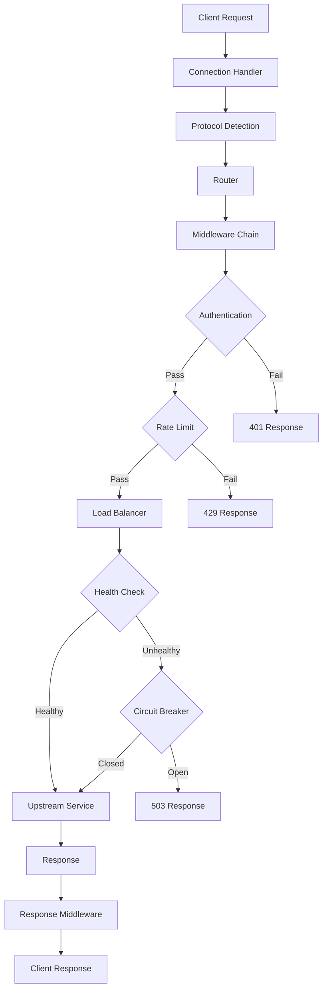

import { Card, Cards } from 'fumadocs-ui/components/card';

# Core Concepts

Learn the fundamental concepts that power Octopus API Gateway.

## Overview

Octopus is built on several key concepts that work together to provide a powerful, flexible API gateway:

<Cards>
  <Card
    title="Architecture"
    description="Understand how Octopus components work together"
    href="/docs/concepts/architecture"
  />
  <Card
    title="Routing"
    description="How requests are matched and routed to upstreams"
    href="/docs/concepts/routing"
  />
  <Card
    title="Middleware"
    description="Process requests and responses in a pipeline"
    href="/docs/concepts/middleware"
  />
  <Card
    title="Plugins"
    description="Extend Octopus with custom functionality"
    href="/docs/concepts/plugins"
  />
  <Card
    title="FARP Protocol"
    description="Automatic service discovery and route generation"
    href="/docs/concepts/farp"
  />
  <Card
    title="Load Balancing"
    description="Distribute traffic across backend instances"
    href="/docs/concepts/load-balancing"
  />
  <Card
    title="Health Checks"
    description="Monitor and manage upstream health"
    href="/docs/concepts/health-checks"
  />
  <Card
    title="Circuit Breaker"
    description="Protect services from cascading failures"
    href="/docs/concepts/circuit-breaker"
  />
</Cards>

## Request Flow

Understanding how a request flows through Octopus:



## Key Components

### 1. Server

The HTTP server that accepts incoming connections:

- Built on Tokio and Hyper
- Supports HTTP/1.1, HTTP/2, and HTTP/3 (experimental)
- Connection pooling and keep-alive
- Graceful shutdown

### 2. Router

Matches incoming requests to routes:

- Trie-based path matching for O(k) lookup time
- Supports path parameters (`:id`) and wildcards (`*`)
- Method-based routing
- Priority-based matching

### 3. Middleware

Processes requests and responses:

- Ordered execution pipeline
- Built-in middleware: auth, rate limit, CORS, compression
- Custom middleware via plugins
- Request and response transformation

### 4. Service Discovery

Finds and tracks backend services:

- Multiple backends: Kubernetes, Consul, etcd, Eureka
- DNS SRV records
- Static configuration
- FARP protocol for auto-discovery

### 5. Load Balancer

Distributes traffic across instances:

- Round-robin
- Least connections
- Weighted round-robin
- IP hash
- Consistent hashing

### 6. Health Tracker

Monitors upstream health:

- Active health checks (HTTP, TCP, gRPC)
- Passive health detection
- Automatic instance removal/addition
- Circuit breaker integration

### 7. Plugin System

Extends functionality:

- Static plugins (compiled in)
- Dynamic plugins (loaded at runtime)
- Plugin capabilities: middleware, protocol handlers, admin UI
- Type-safe Rust trait system

## Design Principles

### 1. Performance First

- Zero-copy proxying where possible
- Async I/O with Tokio
- Connection pooling
- Minimal allocations
- Lock-free data structures

### 2. Stateless by Default

- Gateway instances are stateless
- Easy horizontal scaling
- Optional state via plugins (Redis, etc.)

### 3. Type Safety

- Leverages Rust's type system
- Compile-time guarantees
- No null pointer exceptions
- Memory safety without garbage collection

### 4. Extensibility

- Plugin system for custom logic
- Middleware pipeline for request processing
- Protocol handlers for custom protocols
- Admin dashboard extensions

### 5. Observability

- Prometheus metrics
- OpenTelemetry tracing
- Structured logging
- Built-in from day one

### 6. Production Ready

- Health checks
- Circuit breakers
- Graceful shutdown
- Error handling
- Timeouts and retries

## Configuration Model

Octopus uses a declarative configuration model:

```yaml
# What you configure
server:
  http_port: 8080

routes:
  - path: /api/*
    upstream: my-service

# Octopus handles
- Connection management
- Request routing
- Load balancing
- Health checking
- Error handling
- Metrics collection
```

## Next Steps

Dive deeper into specific concepts:

- [Architecture](/docs/concepts/architecture) - System design and components
- [Routing](/docs/concepts/routing) - How routing works
- [Middleware](/docs/concepts/middleware) - Request processing pipeline
- [Plugins](/docs/concepts/plugins) - Extending Octopus
- [FARP Protocol](/docs/concepts/farp) - Automatic service discovery

Or explore practical guides:

- [Configuration Guide](/docs/configuration) - Configure Octopus
- [Middleware Guide](/docs/middleware) - Use middleware
- [Plugin Development](/docs/plugins/development) - Create plugins

