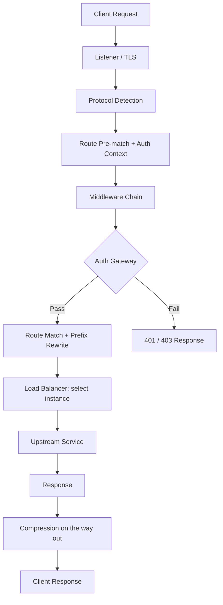

import { Card, Cards } from 'fumadocs-ui/components/card';
import { Callout } from 'fumadocs-ui/components/callout';

# Core Concepts

Learn the fundamental concepts that power Octopus API Gateway.

## Overview

Octopus is built on several key concepts that work together to provide a powerful, flexible API gateway:

<Cards>
  <Card
    title="Architecture"
    description="Understand how Octopus components work together"
    href="/docs/concepts/architecture"
  />
  <Card
    title="Request Lifecycle"
    description="The path a request takes through the gateway"
    href="/docs/concepts/request-lifecycle"
  />
  <Card
    title="Routing"
    description="How requests are matched and routed to upstreams"
    href="/docs/concepts/routing"
  />
  <Card
    title="Middleware"
    description="Process requests and responses in a pipeline"
    href="/docs/concepts/middleware"
  />
  <Card
    title="Plugins"
    description="Extend Octopus with custom functionality"
    href="/docs/concepts/plugins"
  />
  <Card
    title="FARP Protocol"
    description="Automatic service discovery and route generation"
    href="/docs/concepts/farp"
  />
  <Card
    title="Service Discovery"
    description="How static and discovered upstreams come together"
    href="/docs/concepts/service-discovery"
  />
  <Card
    title="Load Balancing"
    description="Distribute traffic across backend instances"
    href="/docs/concepts/load-balancing"
  />
  <Card
    title="Health Checks"
    description="Monitor and manage upstream health"
    href="/docs/concepts/health-checks"
  />
  <Card
    title="Circuit Breaker"
    description="Protect services from cascading failures"
    href="/docs/concepts/circuit-breaker"
  />
</Cards>

## Request Flow

Understanding how a request flows through Octopus. The live chain today is
compression (optional) and the auth gateway (optional); see
[Request Lifecycle](/docs/concepts/request-lifecycle) for the source-verified
path and [Middleware](/docs/middleware) for which middleware are wired.



<Callout type="info" title="Not every box is enforced today">
  The auth gateway runs only when auth providers are configured (or global
  enforcement is on). Per-route rate limiting and CORS are parsed but not
  enforced in the live chain, and load-balancing policy / health checks /
  circuit breaking are wired on the Kubernetes operator path — see the notes on
  each concept page below.
</Callout>

## Key Components

### 1. Server

The HTTP server that accepts incoming connections:

- Built on Tokio and Hyper
- Supports HTTP/1.1, HTTP/2, and HTTP/3 (experimental)
- Connection pooling and keep-alive
- Graceful shutdown

### 2. Router

Matches incoming requests to routes:

- Trie-based path matching for O(k) lookup time
- Supports path parameters (`:id`) and wildcards (`*`)
- Method-based routing
- Priority-based matching

### 3. Middleware

An ordered Rust chain that wraps the request/response path. The live chain today
holds at most two entries — compression and the auth gateway — assembled in code
(there is no `middleware:` config array). A larger catalogue of middleware exists
in the `octopus-middleware` crate but is builder-only. See [Middleware](/docs/middleware).

### 4. Service Discovery

Finds and tracks backend services:

- Discovery backends: Kubernetes (EndpointSlice), Consul, DNS, mDNS
- Static configuration via `upstreams`
- FARP protocol for schema-driven auto-routing

See [Service Discovery](/docs/concepts/service-discovery) and [FARP](/docs/farp).

### 5. Load Balancer

Selects an instance per request. Policies: round-robin, least-connections,
weighted, random, and IP-hash. The policy and instance weights are honored on the
Kubernetes/operator path; static-config upstreams currently balance round-robin
regardless of `lb_policy`. See [Load Balancing](/docs/concepts/load-balancing).

### 6. Health Tracker

Monitors upstream health with active checks (HTTP, TCP, gRPC). Active health
checking and circuit breaking are wired on the operator-driven path; on the
static-config path they are parsed and validated but not yet enforced. See
[Health Checks](/docs/concepts/health-checks) and [Circuit Breaker](/docs/concepts/circuit-breaker).

### 7. Plugin System

A plugin SDK plus lifecycle runtime and a dynamic shared-library loader:

- Static plugins (compiled in) and dynamic plugins (`.so`/`.dylib`/`.dll`)
- Type-safe Rust trait system with lifecycle hooks
- An embedded Rhai scripting engine

The SDK and loader are implemented, but the `plugins:` config array is not yet
consumed at request time. See [Plugins](/docs/concepts/plugins) and [Plugins & Scripting](/docs/plugins).

## Design Principles

### 1. Performance First

- Zero-copy proxying where possible
- Async I/O with Tokio
- Connection pooling
- Minimal allocations
- Lock-free data structures

### 2. Stateless by Default

- Gateway instances are stateless
- Easy horizontal scaling
- Optional state via plugins (Redis, etc.)

### 3. Type Safety

- Leverages Rust's type system
- Compile-time guarantees
- No null pointer exceptions
- Memory safety without garbage collection

### 4. Extensibility

- Plugin system for custom logic
- Middleware pipeline for request processing
- Protocol handlers for custom protocols
- Admin dashboard extensions

### 5. Observability

- Prometheus metrics
- OpenTelemetry tracing
- Structured logging
- Built-in from day one

### 6. Production Ready

- Health checks
- Circuit breakers
- Graceful shutdown
- Error handling
- Timeouts and retries

## Configuration Model

Octopus uses a declarative configuration model:

```yaml
# What you configure
server:
  http_port: 8080

routes:
  - path: /api/*
    upstream: my-service

# Octopus handles
- Connection management
- Request routing
- Load balancing
- Health checking
- Error handling
- Metrics collection
```

## Next Steps

Dive deeper into specific concepts:

- [Architecture](/docs/concepts/architecture) - System design and components
- [Request Lifecycle](/docs/concepts/request-lifecycle) - The path of a request
- [Routing](/docs/concepts/routing) - How routing works
- [Middleware](/docs/concepts/middleware) - Request processing chain
- [Plugins](/docs/concepts/plugins) - Extending Octopus
- [FARP Protocol](/docs/concepts/farp) - Automatic service discovery

Or explore practical guides:

- [Configuration Guide](/docs/configuration) - Configure Octopus
- [Middleware Guide](/docs/middleware) - Use middleware
- [Writing Plugins](/docs/plugins/writing-plugins) - Create plugins

