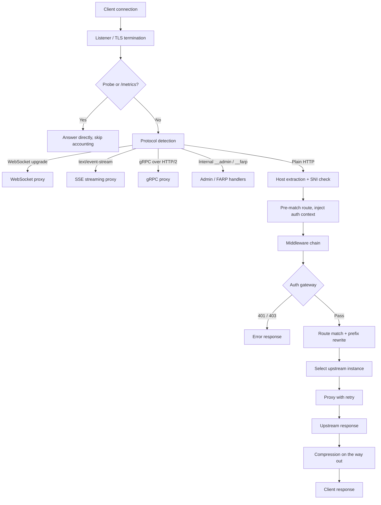

import { Callout } from 'fumadocs-ui/components/callout';
import { Steps, Step } from 'fumadocs-ui/components/steps';

# Request Lifecycle

This page traces a single request from the moment a connection is accepted to the
moment the response is written back. It is **source-verified** against the runtime
handler (`crates/octopus-runtime/src/handler.rs`) and server setup
(`crates/octopus-runtime/src/server.rs`), so it reflects what actually runs today
rather than an aspirational design.

## The path at a glance

## Step by step

<Steps>

<Step>
### Listener and TLS

Each inbound connection is served by hyper's automatic protocol builder, which
negotiates **HTTP/1.1 or HTTP/2 per connection** on the same port (h2c via
prior-knowledge), and supports the connection upgrade that WebSocket needs. When
TLS is enabled, the connection is terminated first — either with a static
certificate or an operator-managed, hot-swappable certificate. The negotiated SNI
is captured for the anti-spoofing check below. See [TLS](/docs/configuration/tls)
and [HTTP/1.1 & HTTP/2](/docs/protocols/http).
</Step>

<Step>
### Probes and metrics (before accounting)

Kubernetes-style health probes (`/livez`, `/readyz`, `/startupz`) and the
Prometheus endpoint (`/metrics`, `/__metrics`) are answered **before** the
in-flight request counter is incremented, so a readiness poll during drain never
inflates request metrics or holds up graceful shutdown. See
[Probes & drain](/docs/kubernetes/probes-and-drain) and [Metrics](/docs/observability/metrics).
</Step>

<Step>
### Protocol detection

Before the request body is buffered, the handler checks for protocols that need
streaming or upgrades, in this order:

- **WebSocket** — a `Connection: Upgrade` / `Upgrade: websocket` request is
  handled by the WebSocket proxy (the upstream is connected first, failing fast
  with `502` if unreachable, then a `101 Switching Protocols` is returned). See
  [WebSocket](/docs/protocols/websocket).
- **SSE** — an `Accept: text/event-stream` request is streamed through the SSE
  proxy with zero buffering. See [SSE](/docs/protocols/sse).
- **gRPC** — a gRPC-over-HTTP/2 request is proxied transparently, propagating the
  `grpc-timeout` deadline. See [gRPC](/docs/protocols/grpc).

Internal routes are also intercepted here: `/__admin` (admin API/dashboard) and
the FARP API/push routes (`/__farp`, `/__/farp`, `/_farp/v1`, and the
`/docs`/`/swagger`/`/redoc` doc UIs). Everything else falls through to the plain
HTTP path, where the body is buffered into memory before proxying.
</Step>

<Step>
### Host extraction and SNI anti-spoofing

The request host is taken from the HTTP/2 `:authority` (or the `Host` header),
lowercased with any port stripped. When TLS is in play and the check is enabled
(the default), a request whose host disagrees with the negotiated TLS SNI is
rejected with `421 Misdirected Request` — this defends against host spoofing and
HTTP/2 connection coalescing across tenants.
</Step>

<Step>
### Route pre-match and auth context

The handler pre-matches the route for `(host, method, path)` and injects the
matched route's auth settings (`auth_provider`, `skip_auth`, `require_roles`,
`require_scopes`, `authz_rule`) and any per-route CORS override into the request
extensions. This happens *before* the chain runs, so the auth gateway can honor
per-route auth. See [Routing](/docs/concepts/routing) and [Routes](/docs/configuration/routes).
</Step>

<Step>
### The middleware chain

The global chain is assembled once at startup and applied to every plain-HTTP
request. It contains **at most two entries**, in this order:

1. **Compression** — added when `gateway.compression.enabled` (the default).
   Registered first, it is the outermost wrapper and compresses the response body
   on the way out. See [Compression](/docs/middleware/compression).
2. **Auth gateway** — added when there is at least one configured auth provider
   **or** `auth.global_enforce` is on. It authenticates and authorizes the
   request, returning `401`/`403` and short-circuiting the chain on failure. See
   [Authentication gateway](/docs/middleware/authentication).

If neither condition holds, the chain is empty and the request goes straight to
routing and proxying.

<Callout type="warn" title="There is no configurable middleware stack">
  You cannot declare an ordered `middleware:` array in YAML — that key does not
  exist. Per-route `rate_limit` and `cors` are parsed and stored but **not**
  enforced in the live chain, and the broader `octopus-middleware` catalogue
  (CORS, rate limiting, caching, security headers, WAF, …) is builder-only. See
  [Middleware](/docs/middleware) for the full wiring status.
</Callout>
</Step>

<Step>
### Route match and prefix rewrite

Inside the final handler the route is matched in the trie router by host, method,
and path, with priority breaking ties. The matched route's `strip_prefix` is
removed and `add_prefix` is prepended (in that order) to form the upstream path;
the query string is preserved. A no match returns `404`. See
[Routing](/docs/concepts/routing).
</Step>

<Step>
### Upstream selection (load balancing)

The route resolves to an upstream cluster, and the load balancer selects an
instance. Convention/subdomain routes derive the `{namespace, service}` target
from the host (optionally via a Rhai script) and lazily register a Service-DNS
upstream. If no instance can be selected, the gateway returns `503`. See
[Load Balancing](/docs/concepts/load-balancing) and
[Service Discovery](/docs/concepts/service-discovery).

<Callout type="info">
  Load-balancing policy and instance weights are honored on the
  Kubernetes/operator path; static-config upstreams currently balance
  round-robin. See [Upstreams](/docs/configuration/upstreams).
</Callout>
</Step>

<Step>
### Proxy and response

The proxy forwards the request to the selected instance (`proxy_with_retry`),
adding forwarding headers — including an `X-Request-ID` toward the upstream when
absent. The upstream response flows back out through the chain: the compression
middleware compresses the body, latency and outcome are recorded to metrics and
the activity log, and the response is written to the client. Upstream failures
surface as `502 Bad Gateway`.
</Step>

</Steps>

## Status codes the gateway can produce

| Status | When |
| --- | --- |
| `101 Switching Protocols` | Successful WebSocket upgrade (after the upstream connects). |
| `401` / `403` | Auth gateway rejects authentication / authorization. |
| `404` | No route matches the request. |
| `421 Misdirected Request` | Host disagrees with the negotiated TLS SNI (anti-spoofing). |
| `502 Bad Gateway` | Upstream connection or proxy error. |
| `503 Service Unavailable` | No healthy upstream instance available. |

## Related

- [Architecture](/docs/concepts/architecture) — the components behind these steps.
- [Routing](/docs/concepts/routing) — trie matching, priority, prefix rewriting.
- [Middleware](/docs/middleware) — the real chain and full catalogue.
- [Protocols](/docs/protocols) — WebSocket, SSE, gRPC, and HTTP handling.
- [Security](/docs/security) — TLS, SNI, and the auth model.
