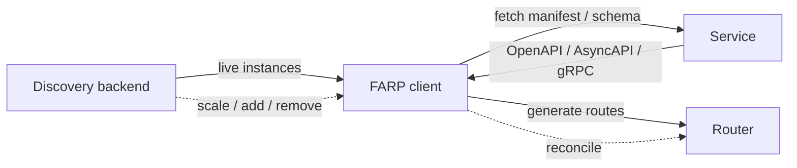

import { Callout } from 'fumadocs-ui/components/callout';
import { Cards, Card } from 'fumadocs-ui/components/card';
import { Steps, Step } from 'fumadocs-ui/components/steps';

# Service Discovery

Service discovery is how Octopus learns *which backends exist* and *where they
are*. There are two complementary models, and you can use either or both:

- **Static upstreams** — you declare backends and their instances by hand in
  configuration. Routes target an upstream by name.
- **Discovered upstreams** — a discovery backend reports live instances, and
  **FARP** turns each service's published schema into routes automatically.

<Callout type="info">
  Static and discovered upstreams coexist. A typical deployment pins a few
  critical backends statically and lets discovery handle the rest.
</Callout>

## Static upstreams

A static upstream is a named cluster of instances you write out yourself. This is
the most explicit model and needs no discovery infrastructure:

```yaml
upstreams:
  - name: user-service
    lb_policy: round_robin
    instances:
      - id: user-1
        host: 10.0.0.11
        port: 8080
      - id: user-2
        host: 10.0.0.12
        port: 8080

routes:
  - path: /api/users/*
    upstream: user-service
```

Static upstreams are ideal for fixed backends, external dependencies, or local
development. See [Upstreams](/docs/configuration/upstreams) and
[Routes](/docs/configuration/routes) for the full schema.

## Discovered upstreams and FARP

For dynamic environments — services that scale, appear, and disappear — declaring
every instance by hand does not scale. **FARP** (the Forge API Gateway
Registration Protocol) flips the model: services publish their own schema, a
discovery backend reports their live instances, and Octopus generates the routes.

### The discovery loop

<Steps>

<Step>
### Discover

A discovery backend reports the set of live service instances and their
addresses. FARP can source instances from **mDNS/Bonjour** (zero-config local
development), **Consul**, **DNS** (SRV/A records), or **Kubernetes**
(EndpointSlice-based Pod discovery). Backends are configured under
`farp.discovery.backends`. See [Discovery backends](/docs/farp/backends).
</Step>

<Step>
### Fetch schema

For each discovered service, Octopus retrieves its published schema (its FARP
manifest). In the live discovery path services publish an **OpenAPI** document;
the federated API surface additionally merges AsyncAPI and GraphQL schemas. See
[Schema federation](/docs/farp/schema-federation).
</Step>

<Step>
### Generate routes

The paths and methods from each schema become gateway routes pointing at the
discovered upstream. No hand-written `routes:` entries are needed for these
services.
</Step>

<Step>
### Watch and reconcile

Octopus watches for changes and updates the router as services scale, appear, or
disappear — without dropping existing connections. In Kubernetes, EndpointSlice
events reflect Pod scale up/down that a Service-only watch would miss.
</Step>

</Steps>



## Kubernetes discovery vs. the operator

Two distinct mechanisms populate the gateway inside Kubernetes — keep them
separate:

- **Discovery** (a FARP `kubernetes` backend) populates **upstream instances**
  from the `discovery.k8s.io/v1` EndpointSlice API. Endpoint `ready` conditions
  map to instance health. See [Kubernetes discovery](/docs/kubernetes/discovery).
- **The operator** programs **routes** from Gateway API / Octopus CRDs. It is
  also the path on which load-balancing policy, health checks, and circuit
  breakers are wired into live behavior. See [Operator](/docs/kubernetes/operator).

<Callout type="warn">
  Load-balancing policy, active health checks, and circuit breaking are wired on
  the Kubernetes/operator-driven path. For upstreams registered from a **static
  config file**, those fields are parsed and validated but not yet enforced —
  static balancing falls back to round-robin. See
  [Upstreams](/docs/configuration/upstreams).
</Callout>

## Related

<Cards>
  <Card title="FARP Protocol" description="The conceptual overview of auto-discovery and route generation." href="/docs/concepts/farp" />
  <Card title="Service Discovery & FARP" description="The reference section: how published schemas become auto-routed APIs." href="/docs/farp" />
  <Card title="Discovery backends" description="Configuring mDNS, Consul, DNS, and Kubernetes discovery." href="/docs/farp/backends" />
  <Card title="Kubernetes discovery" description="EndpointSlice-based Pod discovery for in-cluster deployments." href="/docs/kubernetes/discovery" />
  <Card title="Upstreams" description="Static backends, instances, load balancing, health checks." href="/docs/configuration/upstreams" />
  <Card title="Load Balancing" description="How instances are selected once an upstream is resolved." href="/docs/concepts/load-balancing" />
</Cards>
